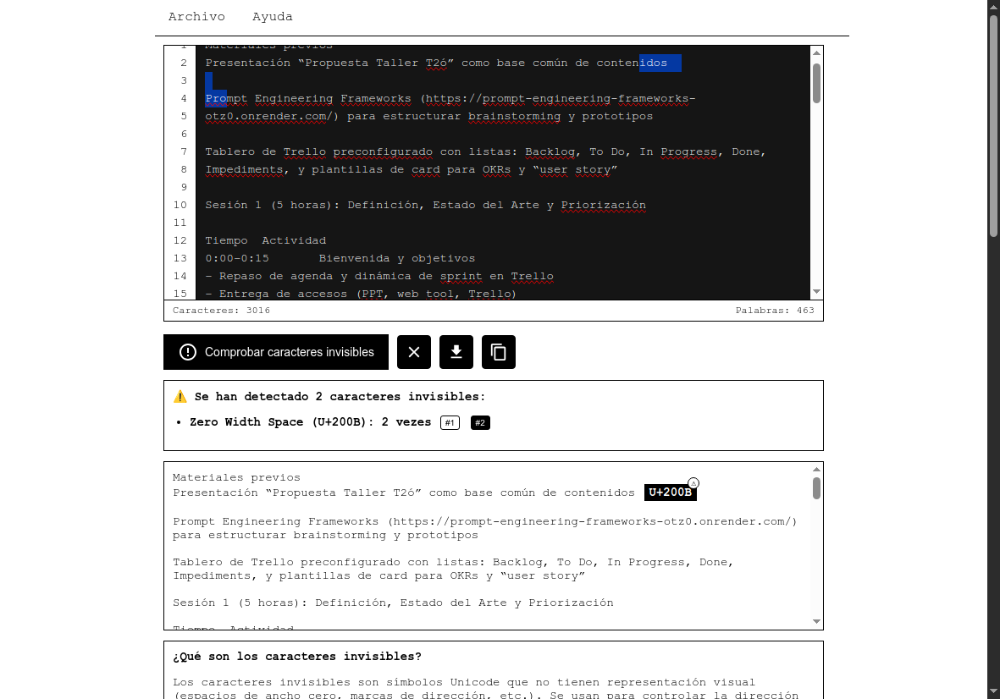

# Detector de caracteres invisibles unicode


## 📋 Descripción

Herramienta web para detectar, analizar y visualizar caracteres Unicode invisibles en texto. Estos caracteres sin representación visual suelen ser insertados inadvertidamente por modelos de IA durante la generación de texto y pueden causar problemas en ciertos contextos.



## 🎬 Demostración

[Ver video de demostración](media/poc.mp4)

## 🔍 ¿Por qué detectar caracteres invisibles?

Los modelos de IA como GPT, Claude, Llama y otros suelen insertar caracteres invisibles en sus respuestas por varias razones:

- **Procesamiento interno**: Los modelos procesan texto en unidades llamadas "tokens". Al convertir estos tokens de vuelta a texto, a veces se introducen caracteres invisibles como artefactos del proceso.
  
- **Tokenización multisistema**: Para manejar diferentes idiomas y sistemas de escritura, los modelos utilizan marcadores de dirección (RTL/LTR) que pueden quedar en el texto final.
  
- **Formateo de texto**: Al generar texto con formato específico (código, tablas, listas), pueden usar caracteres invisibles para controlar la disposición.
  
- **Control del flujo de texto**: Para evitar que ciertas palabras se rompan o para mantener formatos específicos, los modelos pueden usar caracteres como ZWSP (Zero Width Space).

## 🚀 Funcionalidades

- ✅ Detección de 20 tipos diferentes de caracteres Unicode invisibles
- ✅ Editor de texto con numeración de líneas y contadores de palabras/caracteres
- ✅ Visualización precisa de la posición exacta de cada carácter invisible
- ✅ Resaltado interactivo y navegación a caracteres detectados
- ✅ Generación de informes detallados exportables
- ✅ Documentación completa sobre cada tipo de carácter
- ✅ Interfaz minimalista inspirada en bloc de notas clásico

## 💻 Uso

1. Copie y pegue el texto que desea analizar en el área de texto
2. Haga clic en "Comprobar caracteres invisibles"
3. Examine los resultados detallados y la vista previa con caracteres resaltados
4. Utilice los botones de navegación para saltar a posiciones específicas
5. Descargue o copie el informe completo si es necesario

## 🔎 Caracteres invisibles detectados

| Código | Nombre | Descripción | Más información |
|--------|--------|-------------|----------------|
| U+200B | Zero Width Space | Espacio de ancho cero. Indica posible división de palabras sin mostrar un espacio visible. | [Wikipedia](https://en.wikipedia.org/wiki/Zero-width_space) |
| U+200C | Zero Width Non-Joiner | Previene la ligadura entre caracteres que normalmente se unirían. | [Unicode.org](https://www.unicode.org/charts/PDF/U2000.pdf) |
| U+200D | Zero Width Joiner | Causa la unión de caracteres que normalmente no se ligarían. Usado en emojis compuestos. | [Unicode.org](https://www.unicode.org/charts/PDF/U2000.pdf) |
| U+FEFF | Zero Width No-Break Space | También conocido como BOM (Byte Order Mark). Indica orden de bytes en codificaciones. | [Wikipedia](https://en.wikipedia.org/wiki/Byte_order_mark) |
| U+2060 | Word Joiner | Similar al ZWSP pero no indica división de palabras. Previene saltos entre palabras. | [Unicode.org](https://www.unicode.org/charts/PDF/U2000.pdf) |
| U+180E | Mongolian Vowel Separator | Separa vocales en escritura mongola tradicional. | [Unicode.org](https://www.unicode.org/charts/PDF/U1800.pdf) |
| U+200E | Left-to-Right Mark | Fuerza dirección de izquierda a derecha para el texto siguiente. | [Wikipedia](https://en.wikipedia.org/wiki/Left-to-right_mark) |
| U+200F | Right-to-Left Mark | Fuerza dirección de derecha a izquierda para el texto siguiente. | [Wikipedia](https://en.wikipedia.org/wiki/Right-to-left_mark) |
| U+202A | Left-to-Right Embedding | Establece un nuevo nivel de incrustación con dirección LTR. | [Unicode.org](https://www.unicode.org/charts/PDF/U2000.pdf) |
| U+202B | Right-to-Left Embedding | Establece un nuevo nivel de incrustación con dirección RTL. | [Unicode.org](https://www.unicode.org/charts/PDF/U2000.pdf) |
| U+202C | Pop Directional Formatting | Finaliza el último nivel de formato direccional. | [Unicode.org](https://www.unicode.org/charts/PDF/U2000.pdf) |
| U+202D | Left-to-Right Override | Fuerza toda la secuencia siguiente a ser tratada como LTR. | [Unicode.org](https://www.unicode.org/charts/PDF/U2000.pdf) |
| U+202E | Right-to-Left Override | Fuerza toda la secuencia siguiente a ser tratada como RTL. | [Unicode.org](https://www.unicode.org/charts/PDF/U2000.pdf) |
| U+2061 | Function Application | Símbolo matemático invisible que representa la aplicación de funciones. | [Unicode.org](https://www.unicode.org/charts/PDF/U2000.pdf) |
| U+2062 | Invisible Times | Representa una multiplicación invisible en notación matemática. | [Unicode.org](https://www.unicode.org/charts/PDF/U2000.pdf) |
| U+2063 | Invisible Separator | Separador invisible usado en notación matemática. | [Unicode.org](https://www.unicode.org/charts/PDF/U2000.pdf) |
| U+2064 | Invisible Plus | Representa una suma invisible en notación matemática. | [Unicode.org](https://www.unicode.org/charts/PDF/U2000.pdf) |
| U+034F | Combining Grapheme Joiner | Une grafemas o unidades visuales en escrituras complejas. | [Unicode.org](https://www.unicode.org/charts/PDF/U0300.pdf) |
| U+061C | Arabic Letter Mark | Controla el comportamiento de texto árabe en entornos bidireccionales. | [Unicode.org](https://www.unicode.org/charts/PDF/U0600.pdf) |
| U+00AD | Soft Hyphen | Guión invisible que solo aparece cuando una palabra debe cortarse al final de línea. | [Wikipedia](https://en.wikipedia.org/wiki/Soft_hyphen) |

## 🔧 Implementación técnica

Este proyecto está implementado utilizando:

- HTML5 para la estructura
- CSS3 para estilos minimalistas en blanco y negro
- JavaScript vanilla para toda la lógica de detección y manipulación

La arquitectura del código sigue un enfoque modular con clara separación de:
- Interfaz de usuario y componentes visuales
- Lógica de detección y análisis de caracteres
- Generación de informes y exportación

## 📦 Instalación

1. Clone este repositorio:
```bash
git clone https://github.com/686f6c61/artificial-intelligence-text-detector-unicode.git
```

2. Abra `index.html` en su navegador para comenzar a usar la aplicación.

No se requieren dependencias externas ni pasos de compilación.

## 🤔 Casos de uso comunes

- **Desarrollo de software**: Identificar caracteres invisibles en código que pueden causar errores difíciles de depurar
- **Procesamiento de texto**: Limpiar textos generados por IA antes de usarlos en entornos sensibles
- **Seguridad**: Detectar posibles marcas invisibles en textos que podrían indicar su origen
- **Compatibilidad**: Verificar textos antes de insertarlos en sistemas con limitaciones de caracteres
- **Análisis de IA**: Estudiar patrones de inserción de caracteres en diferentes modelos de IA

## 📊 Limitaciones

La detección de caracteres invisibles puede ayudar a identificar contenido generado por IA, pero no es concluyente por sí misma. Otros factores como patrones lingüísticos, estructura del texto y contexto deben considerarse para un análisis completo.

## 🔄 Actualizaciones futuras

- Soporte para más tipos de caracteres Unicode
- Análisis estadístico de frecuencias y patrones
- Modo de limpieza automática de caracteres invisibles
- Integración con APIs de detección de texto generado por IA

## 📝 Licencia

Este proyecto está licenciado bajo la Licencia MIT. Consulte el archivo LICENSE para más detalles.

## 📰 Artículos relacionados

Estos artículos refuerzan la importancia de detectar caracteres Unicode invisibles en texto generado por IA:

- [AI chatbots can read and write invisible text, creating an ideal covert channel](https://arstechnica.com/security/2024/10/ai-chatbots-can-read-and-write-invisible-text-creating-an-ideal-covert-channel/) - Ars Technica explica cómo los LLMs pueden interpretar y generar caracteres invisibles, creando potenciales canales encubiertos para ataques.
- [New ChatGPT models seem to leave watermarks on text](https://www.rumidocs.com/newsroom/new-chatgpt-models-seem-to-leave-watermarks-on-text) - Análisis sobre posibles "marcas de agua" invisibles que los modelos recientes de OpenAI podrían estar insertando en sus salidas.
- [GPT-4.1 Character Encoding Issues](https://community.openai.com/t/gpt-4-1-character-encoding-issues/1236017) - Discusión en la comunidad de OpenAI sobre problemas de codificación de caracteres en GPT-4.1.

## 👤 Autor

- [686f6c61](https://github.com/686f6c61)
- Twitter: [@hex686f6c61](https://x.com/hex686f6c61)

## 🔗 Enlaces útiles

- [Estándar Unicode](https://unicode.org/)
- [Caracteres de control Unicode](https://en.wikipedia.org/wiki/Unicode_control_characters)
- [Herramientas para desarrolladores Unicode](https://www.unicode.org/resources/developers.html) 